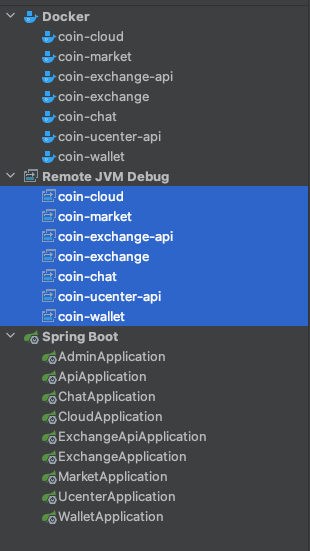

# 方便的搭建

> 这里使用的是 docker 方式运行，所以需要提前安装 docker
> 
> idea 调用 docker 的方式使用的是 socket，这里涉及到的点比较难说明白，所以遇到该问题的直接在群里提问
这里已经吧 dockerfile 以及 idea 的调试即启动已经修改

## docker 国内源

> 配置文件路径 `/etc/docker/daemon.json`

```json
{
 "registry-mirrors" : [
   "https://mirror.ccs.tencentyun.com",
   "https://registry.docker-cn.com",
   "https://docker.mirrors.ustc.edu.cn",
   "https://hub-mirror.c.163.com"
 ],
 "insecure-registries" : [
   "registry.docker-cn.com",
   "docker.mirrors.ustc.edu.cn"
 ],
 "debug" : true,
 "experimental" : true
}
```

## docker 启动基本服务

### mysql
```shell
docker run -d --name "coin-mysql" \
  -p 3306:3306/tcp \
  --network coin \
  --network-alias mysql.coin \
  -v "`pwd`/mysql/data:/var/lib/mysql" \
  -v "`pwd`/mysql/conf:/etc/mysql" \
  -v "`pwd`/mysql/log:/var/log/mysql" \
  -e "TZ=Asia/Shanghai" \
  -e MYSQL_ROOT_PASSWORD="wmjtyd@219z1z46.00" \
  -e MYSQL_USER="bizzan" \
  -e MYSQL_PASSWORD="JSk87nRHFj646iXZ" \
  "mysql:5.7.16"
```
**mysql 启动后的初始化**
```sql
-- 进入mysql 后执行
create database bizzan;
grant all on bizzan.* to 'bizzan'@'%';

-- 整个项目的 sql 已经存在在 sql 目录下直接运行即可
source sql/bizan.sql
    
-- 命令行模式
-- mysql -h 127.0.0.1 -P 3306 -u root -p JSk87nRHFj646iXZ
```

### redis
**redis 配置文件**
```
# 配置文件路径 ./redis/main.conf
# 认证密码
requirepass wmjtyd@6l74476i.00
```
**redis docker 启动命令**
```shell
docker run -d "--read-only" --name "coin-redis" \
  -p 6379:6379/tcp \
  --network coin \
  --network-alias redis.coin \
  -v "`pwd`/redis/main.conf:/usr/local/etc/redis/main.conf" \
  redis:6.0 \
  redis-server \
    "/usr/local/etc/redis/main.conf"
```

### mongodb
```shell
docker run -d --name "coin-mongodb" \
  -p 27017:27017/tcp \
  --network coin \
  --network-alias mongodb.coin \
  -v "`pwd`/mongodb/log:/var/log/mongodb" \
  -v "`pwd`/mongodb/db:/data/db" \
  mongo:6.0.2
```

### zookeeper
```shell
docker run -d --name "coin-zookeeper" \
  --network coin \
  --network-alias zookeeper.coin \
  -v "`pwd`/zookeeper:/bitnami" \
  -e "ALLOW_ANONYMOUS_LOGIN=yes" \
  zookeeper
```

### kafka
```shell
docker run -d --name coin-kafka \
    -p 9092:9092/tcp \
    --network coin \
    --network-alias kafka.coin \
    --privileged=true \
    -v "`pwd`/kafka:/bitnami" \
    -e ALLOW_PLAINTEXT_LISTENER=yes \
    -e KAFKA_CFG_ZOOKEEPER_CONNECT="zookeeper.coin:2181" \
    "bitnami/kafka:2.2.1"
```

## nginx
**https 使用的证书创建**
```shell
openssl req \
    -x509 \
    -nodes \
    -days 365 \
    -newkey rsa:2048 \
    -keyout nginx/conf.d/server.key \
    -out nginx/conf.d/server.crt
```

**前端配置**
```text
# 文件路径 -> nginx/conf.d/default.conf
server {
    listen 80;
    listen [::]:80;
    listen 443 ssl;
    listen [::]:443 ssl;
    
    server_name localhost;
    server_name www.kandle.cc;
    
    ssl_certificate /etc/nginx/conf.d/server.crt;
    ssl_certificate_key /etc/nginx/conf.d/server.key;
    
    location / {
        root   /usr/share/nginx/html;
        index  index.html index.htm;
    }
}
```

**后端配置**

```text
# 文件路径 -> nginx/conf.d/coin.conf
server {
    listen 80;
    listen [::]:80;
    listen 443 ssl;
    listen [::]:443 ssl;
    
    server_name localhost;
    server_name api.kandle.cc;
    
    ssl_certificate /etc/nginx/conf.d/server.crt;
    ssl_certificate_key /etc/nginx/conf.d/server.key;
    
    # 配置 market 的反向代理！
    location /market {
        proxy_pass http://market.coin:6004;
        
        proxy_set_header Host $http_host;
        proxy_set_header X-Real-IP $remote_addr;
        proxy_set_header X-Scheme $scheme;
        proxy_set_header Upgrade $http_upgrade;
        proxy_set_header Connection "upgrade";
        
        #Set Nginx Cache
        add_header X-Cache $upstream_cache_status;
        add_header Cache-Control no-cache;
    }
    
    # 配置 exchange 的反向代理！
    location /exchange {
        proxy_pass http://exchange-api.coin:6003;
        
        proxy_set_header Host $http_host;
        proxy_set_header X-Real-IP $remote_addr;
        proxy_set_header X-Scheme $scheme;
        proxy_set_header Upgrade $http_upgrade;
        proxy_set_header Connection "upgrade";
        
        #Set Nginx Cache
        add_header X-Cache $upstream_cache_status;
        add_header Cache-Control no-cache;
    }
    
    # 配置 uc 的反向代理！
    location /uc {
        proxy_pass http://ucenter-api.coin:6001;
        
        proxy_set_header Host $http_host;
        proxy_set_header X-Real-IP $remote_addr;
        proxy_set_header X-Scheme $scheme;
        proxy_set_header Upgrade $http_upgrade;
        proxy_set_header Connection "upgrade";
    
        #Set Nginx Cache
        add_header X-Cache $upstream_cache_status;
        add_header Cache-Control no-cache;
    }

    # 配置 admin 的反向代理！
    location /admin {
        proxy_pass http://admin-api.coin:6010;
        
        proxy_set_header Host $http_host;
        proxy_set_header X-Real-IP $remote_addr;
        proxy_set_header X-Scheme $scheme;
        proxy_set_header Upgrade $http_upgrade;
        proxy_set_header Connection "upgrade";
        
        #Set Nginx Cache
        add_header X-Cache $upstream_cache_status;
        add_header Cache-Control no-cache;
    }
    
    # 配置 chat 的反向代理！
    location /chat {
        proxy_pass http://chat.coin:6008;
        
        proxy_set_header Host $http_host;
        proxy_set_header X-Real-IP $remote_addr;
        proxy_set_header X-Scheme $scheme;
        proxy_set_header Upgrade $http_upgrade;
        proxy_set_header Connection "upgrade";
        
        #Set Nginx Cache
        add_header X-Cache $upstream_cache_status;
        add_header Cache-Control no-cache;
    }
    
    # 配置 otc 的反向代理！
    location /otc {
        proxy_pass http://otc-api.coin:6006;
        
        proxy_set_header Host $http_host;
        proxy_set_header X-Real-IP $remote_addr;
        proxy_set_header X-Scheme $scheme;
        proxy_set_header Upgrade $http_upgrade;
        proxy_set_header Connection "upgrade";
        
        #Set Nginx Cache
        add_header X-Cache $upstream_cache_status;
        add_header Cache-Control no-cache;
    }
    
}
```

**nginx 启动命令**
> 注意：这里启动失败的原因是后代容器没有运行时会导致找不到主机，请在运行完后端接口后在运行该命令
```shell
docker run -d --name "coin-nginx" \
  -p 80:80 \
  -p 443:443 \
  --network coin \
  --network-alias nginx.coin \
  -v "`pwd`/nginx/conf.d:/etc/nginx/conf.d" \
  -v "`pwd`/nginx/www:/usr/share/nginx/html" \
  nginx:1.19.0
```

## idea service 启动

> 注意: idea 的配置需要 socket 所以遇到问题一定要在群里说明你当前的环境，不同的环境需要不一样的配置方式

先整体执行了一下 `mvn -p dev compile package`

> 注意：如果不懂如何在命令行使用 maven 的最好在 idea 里执行上面的操作


****

**运行配置**: 已经配置过了，直接


**启动优先级**
1. cloud 
2. market
3. exchange
4. 其他

**当然使用以后的配置一次往下运行完全即可**

